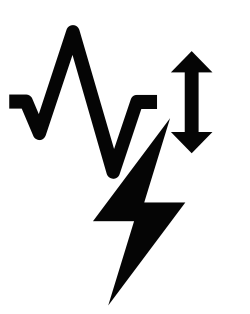

[](https://sonarqube.internal.philips/dashboard?id=philips-internal.energy-monitoring-tool)
[](https://sonarqube.internal.philips/dashboard?id=philips-internal.energy-monitoring-tool)
[](https://sonarqube.internal.philips/dashboard?id=philips-internal.energy-monitoring-tool)     
[](https://sonarqube.internal.philips/dashboard?id=philips-internal.energy-monitoring-tool)
[](https://sonarqube.internal.philips/dashboard?id=philips-internal.energy-monitoring-tool)
[](https://sonarqube.internal.philips/dashboard?id=philips-internal.energy-monitoring-tool)   
[](https://sonarqube.internal.philips/dashboard?id=philips-internal.energy-monitoring-tool)

# Energy Monitoring Tool (EMT) 
EMT is a handy tool that helps you track your code’s energy consumption. As developers, being mindful of the environmental impact of our software is important. EMT makes it easy to monitor and optimize how much energy your code uses, helping you build more eco-friendly applications.

## 🚀 Features

- Real-time energy utilization tracking.
- Device-level breakdown of energy consumption.
- Enegy/Power attribution to a process of interest in a multi-process shared resource setting.
- Modular and extendable software architecture, currently supports following powergroups:
   - CPU(s) with RAPL capabilites.
   - Nvidia GPUs.

   #### Supported Platforms
  -  Linux

> Future Releases:
  >   - Visualizations to identify energy-intensive processes. 
  >   - Environmentally conscious coding tips.
  >   - Virtual CPU(s) covered by Teads dataset.
  >   - Add support for Windows through PCM


## 🌍 Why EMT?

In the era of climate awareness, it's essential for developers to contribute to a sustainable future. EMT Tool empowers you to make informed decisions about your code's impact on the environment and take steps towards writing more energy-efficient software.

## 🛠️ Getting Started

1. Clone the repository: `git clone git@github.com:philips-internal/energy-monitoring-tool.git`
2. Install dependencies:
   ```shell
   cd energy-monitoring-tool
   pip install .
   ````

That's it! You're now ready to analyze the energy footprint of your code.
###  *Usage*:
>We currently plan to support three modes of usage: Python Context Managers,  Keras Callbacks and CLI.
>The *callbacks* focus on working with popular ML library Keras, the python *context manager* mode can
>be easily integrated into any python code, while the *CLI* mode allows usage of the tool for 
> command-line application that are not writtern in python.  
> **Only Python Context Manager Mode is implemented so far!**

#### Using Python Context Managers
```python
import emt
import tensorflow as tf
from emt import EnergyMetering

# setup logging
emt.setup_logger(Path(Path(), 'emt.log’))

def foo(device='gpu'): 
    with tf.device(device):
        # perform tensor operations.
        …

# Create an EnerrgyMeterting Context.
# Energy consumption of the function(s) is
# recorded when called within the context.
with EnergyMetering() as metering:
    results = foo()

# report energy at some later time.
energy = metering.consumed_energy()
 
```

#### 
## 🤝 Contributions

We welcome contributions from the community to make EMT Tool even more robust and feature-rich. To contribute, follow these steps:

1. Fork the repository
2. Create a new branch: `git checkout -b feature/your-feature-name`
3. Make your changes and commit them: `git commit -m 'Add your feature'`
4. Push to the branch: `git push origin feature/your-feature-name`
5. Open a pull request

Please ensure that your pull request includes a clear description of the changes you've made and why they are valuable. Additionally, ensure that your code adheres to the project's coding standards.

## 🚧 Work in Progress

EMT Tool is an ongoing project, and we are actively working to enhance its features and usability. If you encounter any issues or have suggestions, please open an issue on the GitHub repository.


## 📧 Contact

For any inquiries or discussions, feel free to reach out to us at [rameez.ismail@philips.com](mailto:rameez.ismail@philips.com)

Let's code responsibly and make a positive impact on the environment! 🌍✨
